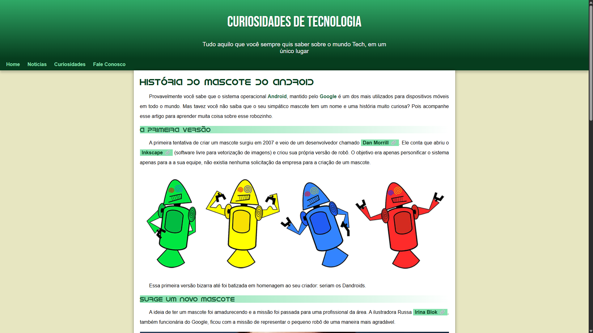
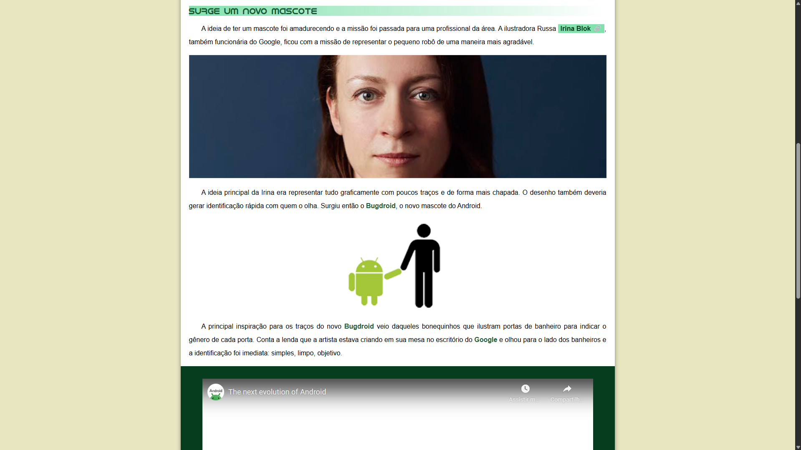
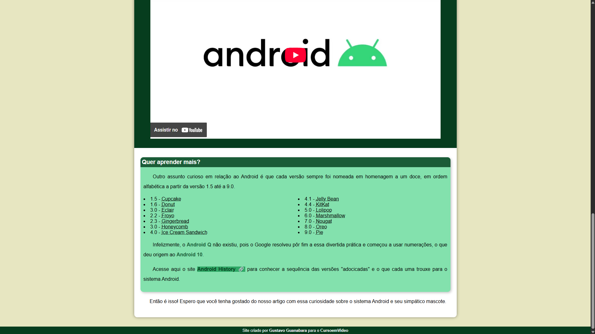

# 🖥️ Curiosidades de Tecnologia

Este é um projeto desenvolvido durante o curso de **HTML5 e CSS3** do canal [Curso em Vídeo](https://www.youtube.com/@CursoemVideo), ministrado pelo professor Gustavo Guanabara. O objetivo foi praticar os conceitos aprendidos construindo uma página web responsiva e semântica sobre a história do mascote do sistema Android.

---

## 📚 Conteúdo abordado

Neste projeto, foram utilizados os seguintes conceitos:

- Estrutura básica HTML
- Tags semânticas (`<header>`, `<main>`, `<section>`, `<article>`, `<footer>`, etc.)
- Estilização com CSS
- Importação de fontes do Google Fonts
- Utilização de imagens e vídeos
- Responsividade básica
- Criação de um layout simples, limpo e funcional

---

## 🧩 Sobre o site

O site apresenta uma matéria fictícia sobre a história do mascote do Android, incluindo:

- Primeiras versões dos mascotes (os Dandroids)
- Criação do Bugdroid por Irina Blok
- Curiosidades sobre os nomes das versões do Android
- Inserção de imagens ilustrativas e um vídeo do YouTube
- Informações organizadas em blocos e seções para melhorar a leitura

---

## 🖼️ Prints do projeto

### Página inicial



---

### Conteúdo sobre o mascote



---

### Versões do Android



---

## 🚀 Como acessar o projeto

Você pode clonar este repositório e abrir o arquivo `index.html` em qualquer navegador:

```bash
git clone https://github.com/seu-usuario/seu-repositorio.git
```

Abra o arquivo `index.html` no navegador da sua escolha.

---

## 🧑‍🏫 Créditos

Projeto realizado durante as aulas do [Curso em Vídeo](https://www.cursoemvideo.com/), com orientação de **Gustavo Guanabara**.
